## 1.python的开发环境的搭建

### 1.1 安装python

- Python有两个版本，分别是2.x和3.x,注意：3.x版本不向下兼容2.x

- 现在主流是python3，我们学习以3.6为主，注意安装的时候，请选择把安装路径加入环境变量

  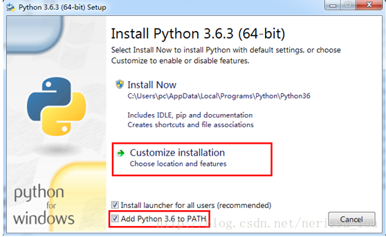

- 如果安装2.7，安装后请手动把安装路径写到环境变量里
  在“我的电脑”右键-->属性，然后选择“高级系统设置”-->“环境变量”

  

选中：高级-->系统环境变量--->path，双击或点编辑

将光标移动变量值的末尾，输入英文“;”，然后将python安装的路径添加进来，然后点击确定

测试是否安装成功:

打开命令行窗口，从开始菜单--运行--输入cmd回车。然后在命令行中输入ptyhon，如果结果如下则表示安装成功。

~~~
C:\Users\python>python
Python 3.6.5 (v3.6.5:f59c0932b4, Mar 28 2018, 17:00:18) [MSC v.1900 64 bit (AMD64)] on win32
Type "help", "copyright", "credits" or "license" for more information.
>>>
~~~

### 1.2 安装集成开发环境pycharm

pycharm集编辑、解释、运行显示为一体，方便代码编写、调试、结果查看。如果安装社区版，不需要破解注册。安装专业版请按照下面的步骤注册

pycharm激活步骤，请参考：https://blog.csdn.net/u014044812/article/details/78727496

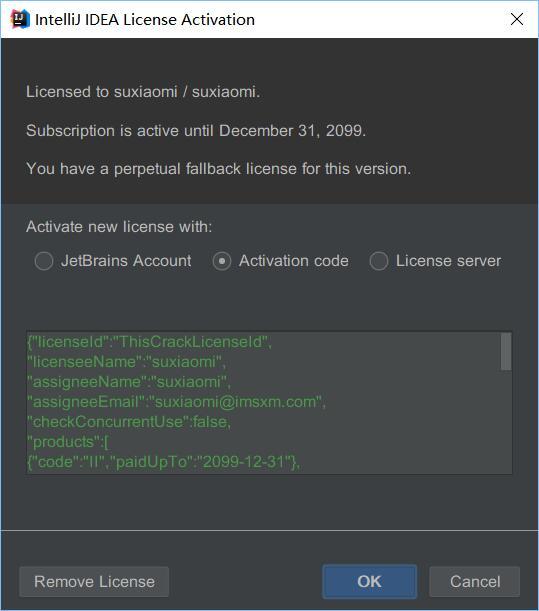

#### 激活码激活:

选择Activation code

##### 1） 修改hosts文件

到windows安装目录：C:\Windows\System32\drivers\etc下，修改hosts文件，注意hosts文件没有后缀。

需要先将hosts文件拷贝到桌面，然后用记事本打开，在文件末尾添加：

~~~
0.0.0.0 account.jetbrains.com
~~~

然后保存，将hosts文件从桌面复制回C:\Windows\System32\drivers\etc目录下，覆盖原来的文件。

##### 2）复制激活码

将下面的激活码复制到输入框中，点击activate即可

~~~
K71U8DBPNE-eyJsaWNlbnNlSWQiOiJLNzFVOERCUE5FIiwibGljZW5zZWVOYW1lIjoibGFuIHl1IiwiYXNzaWduZWVOYW1lIjoiIiwiYXNzaWduZWVFbWFpbCI6IiIsImxpY2Vuc2VSZXN0cmljdGlvbiI6IkZvciBlZHVjYXRpb25hbCB1c2Ugb25seSIsImNoZWNrQ29uY3VycmVudFVzZSI6ZmFsc2UsInByb2R1Y3RzIjpbeyJjb2RlIjoiSUkiLCJwYWlkVXBUbyI6IjIwMTktMDUtMDQifSx7ImNvZGUiOiJSUzAiLCJwYWlkVXBUbyI6IjIwMTktMDUtMDQifSx7ImNvZGUiOiJXUyIsInBhaWRVcFRvIjoiMjAxOS0wNS0wNCJ9LHsiY29kZSI6IlJEIiwicGFpZFVwVG8iOiIyMDE5LTA1LTA0In0seyJjb2RlIjoiUkMiLCJwYWlkVXBUbyI6IjIwMTktMDUtMDQifSx7ImNvZGUiOiJEQyIsInBhaWRVcFRvIjoiMjAxOS0wNS0wNCJ9LHsiY29kZSI6IkRCIiwicGFpZFVwVG8iOiIyMDE5LTA1LTA0In0seyJjb2RlIjoiUk0iLCJwYWlkVXBUbyI6IjIwMTktMDUtMDQifSx7ImNvZGUiOiJETSIsInBhaWRVcFRvIjoiMjAxOS0wNS0wNCJ9LHsiY29kZSI6IkFDIiwicGFpZFVwVG8iOiIyMDE5LTA1LTA0In0seyJjb2RlIjoiRFBOIiwicGFpZFVwVG8iOiIyMDE5LTA1LTA0In0seyJjb2RlIjoiR08iLCJwYWlkVXBUbyI6IjIwMTktMDUtMDQifSx7ImNvZGUiOiJQUyIsInBhaWRVcFRvIjoiMjAxOS0wNS0wNCJ9LHsiY29kZSI6IkNMIiwicGFpZFVwVG8iOiIyMDE5LTA1LTA0In0seyJjb2RlIjoiUEMiLCJwYWlkVXBUbyI6IjIwMTktMDUtMDQifSx7ImNvZGUiOiJSU1UiLCJwYWlkVXBUbyI6IjIwMTktMDUtMDQifV0sImhhc2giOiI4OTA4Mjg5LzAiLCJncmFjZVBlcmlvZERheXMiOjAsImF1dG9Qcm9sb25nYXRlZCI6ZmFsc2UsImlzQXV0b1Byb2xvbmdhdGVkIjpmYWxzZX0=-Owt3/+LdCpedvF0eQ8635yYt0+ZLtCfIHOKzSrx5hBtbKGYRPFDrdgQAK6lJjexl2emLBcUq729K1+ukY9Js0nx1NH09l9Rw4c7k9wUksLl6RWx7Hcdcma1AHolfSp79NynSMZzQQLFohNyjD+dXfXM5GYd2OTHya0zYjTNMmAJuuRsapJMP9F1z7UTpMpLMxS/JaCWdyX6qIs+funJdPF7bjzYAQBvtbz+6SANBgN36gG1B2xHhccTn6WE8vagwwSNuM70egpahcTktoHxI7uS1JGN9gKAr6nbp+8DbFz3a2wd+XoF3nSJb/d2f/6zJR8yJF8AOyb30kwg3zf5cWw==-MIIEPjCCAiagAwIBAgIBBTANBgkqhkiG9w0BAQsFADAYMRYwFAYDVQQDDA1KZXRQcm9maWxlIENBMB4XDTE1MTEwMjA4MjE0OFoXDTE4MTEwMTA4MjE0OFowETEPMA0GA1UEAwwGcHJvZDN5MIIBIjANBgkqhkiG9w0BAQEFAAOCAQ8AMIIBCgKCAQEAxcQkq+zdxlR2mmRYBPzGbUNdMN6OaXiXzxIWtMEkrJMO/5oUfQJbLLuMSMK0QHFmaI37WShyxZcfRCidwXjot4zmNBKnlyHodDij/78TmVqFl8nOeD5+07B8VEaIu7c3E1N+e1doC6wht4I4+IEmtsPAdoaj5WCQVQbrI8KeT8M9VcBIWX7fD0fhexfg3ZRt0xqwMcXGNp3DdJHiO0rCdU+Itv7EmtnSVq9jBG1usMSFvMowR25mju2JcPFp1+I4ZI+FqgR8gyG8oiNDyNEoAbsR3lOpI7grUYSvkB/xVy/VoklPCK2h0f0GJxFjnye8NT1PAywoyl7RmiAVRE/EKwIDAQABo4GZMIGWMAkGA1UdEwQCMAAwHQYDVR0OBBYEFGEpG9oZGcfLMGNBkY7SgHiMGgTcMEgGA1UdIwRBMD+AFKOetkhnQhI2Qb1t4Lm0oFKLl/GzoRykGjAYMRYwFAYDVQQDDA1KZXRQcm9maWxlIENBggkA0myxg7KDeeEwEwYDVR0lBAwwCgYIKwYBBQUHAwEwCwYDVR0PBAQDAgWgMA0GCSqGSIb3DQEBCwUAA4ICAQC9WZuYgQedSuOc5TOUSrRigMw4/+wuC5EtZBfvdl4HT/8vzMW/oUlIP4YCvA0XKyBaCJ2iX+ZCDKoPfiYXiaSiH+HxAPV6J79vvouxKrWg2XV6ShFtPLP+0gPdGq3x9R3+kJbmAm8w+FOdlWqAfJrLvpzMGNeDU14YGXiZ9bVzmIQbwrBA+c/F4tlK/DV07dsNExihqFoibnqDiVNTGombaU2dDup2gwKdL81ua8EIcGNExHe82kjF4zwfadHk3bQVvbfdAwxcDy4xBjs3L4raPLU3yenSzr/OEur1+jfOxnQSmEcMXKXgrAQ9U55gwjcOFKrgOxEdek/Sk1VfOjvS+nuM4eyEruFMfaZHzoQiuw4IqgGc45ohFH0UUyjYcuFxxDSU9lMCv8qdHKm+wnPRb0l9l5vXsCBDuhAGYD6ss+Ga+aDY6f/qXZuUCEUOH3QUNbbCUlviSz6+GiRnt1kA9N2Qachl+2yBfaqUqr8h7Z2gsx5LcIf5kYNsqJ0GavXTVyWh7PYiKX4bs354ZQLUwwa/cG++2+wNWP+HtBhVxMRNTdVhSm38AknZlD+PTAsWGu9GyLmhti2EnVwGybSD2Dxmhxk3IPCkhKAK+pl0eWYGZWG3tJ9mZ7SowcXLWDFAk0lRJnKGFMTggrWjV8GYpw5bq23VmIqqDLgkNzuoog==
~~~

### 1.3 使用pycharm

##### 1) 创建新工程

选择create New Project

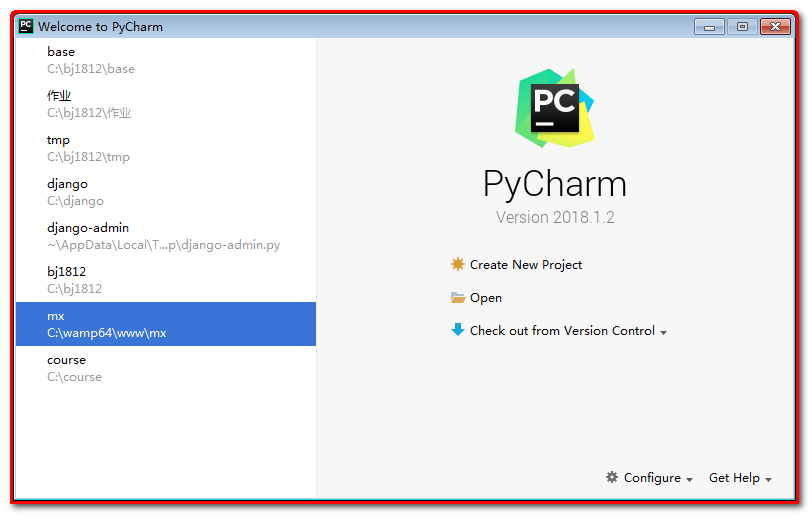

##### 2）设置工程目录

在location中设置你的项目目录，点击后面...按钮选择目录

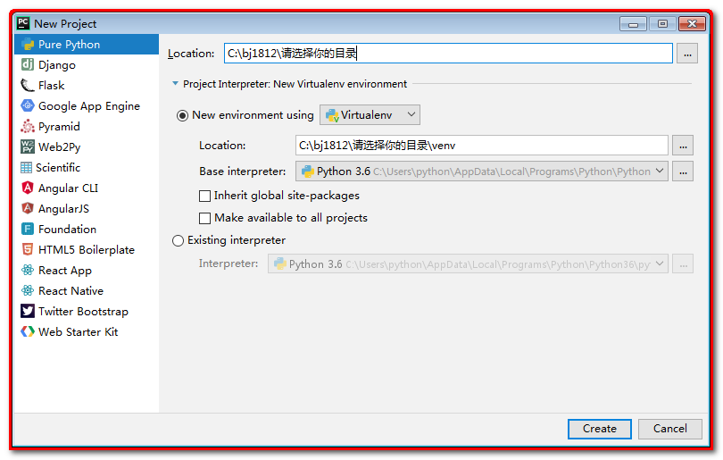

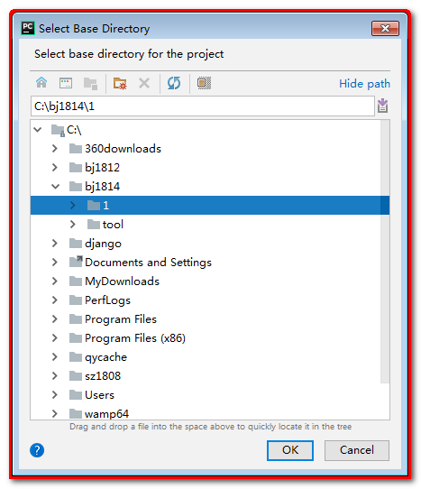3)

如果有下图提示，则表示你选的目录非空，没有关系，直接选yes

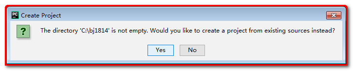

##### 3）pycharm界面

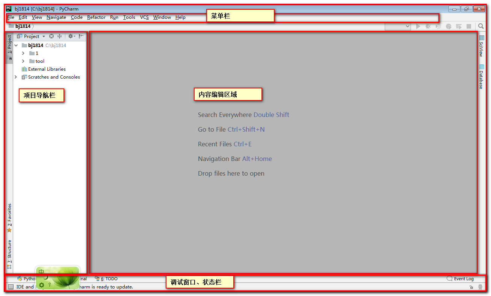

##### 4）新建python文件

​	在code目录上右键，选择New--->Python File

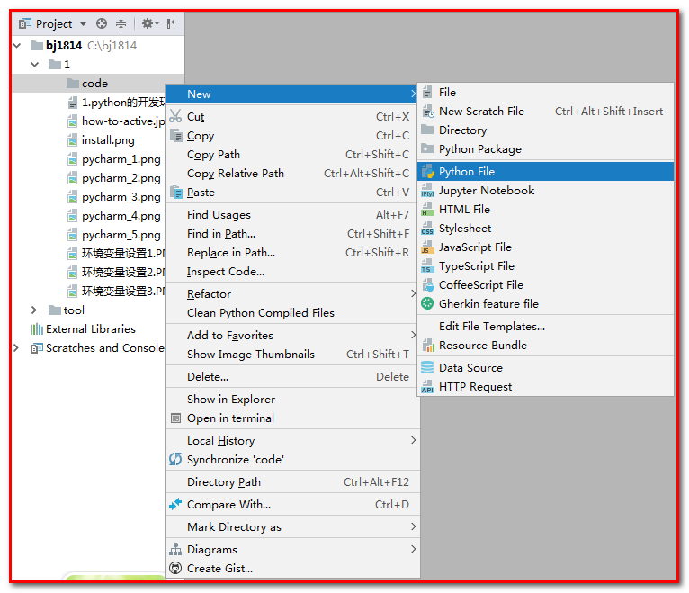

输入文件名：

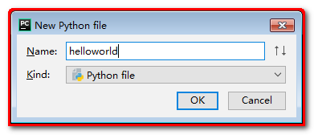

如果有以下提示，则说明，项目没有选择python的解释器

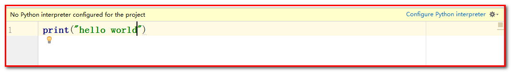

##### 5）设置项目的解释器

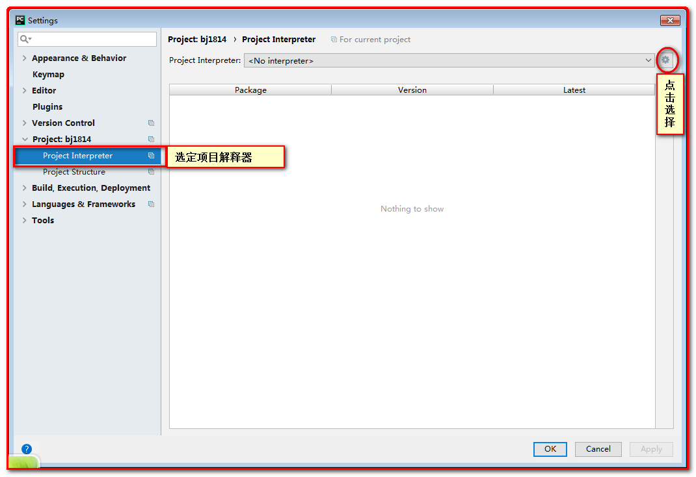

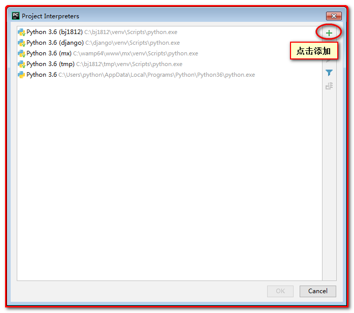

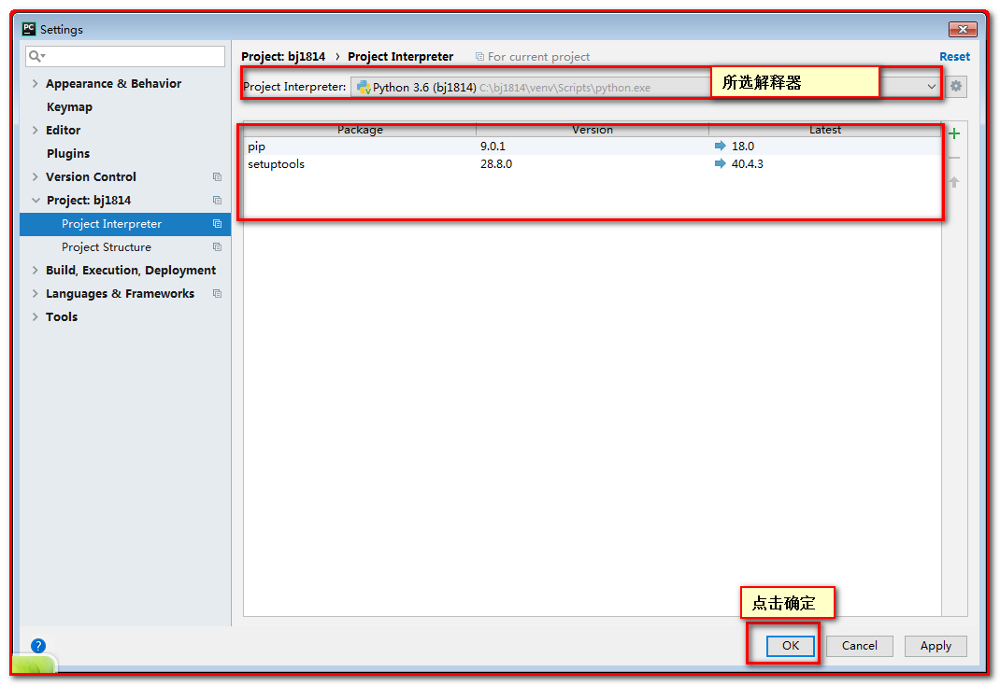

##### 6) 编辑文件

输入以下代码：

~~~
print("hello world")
~~~

然后点击“运行”按钮，执行

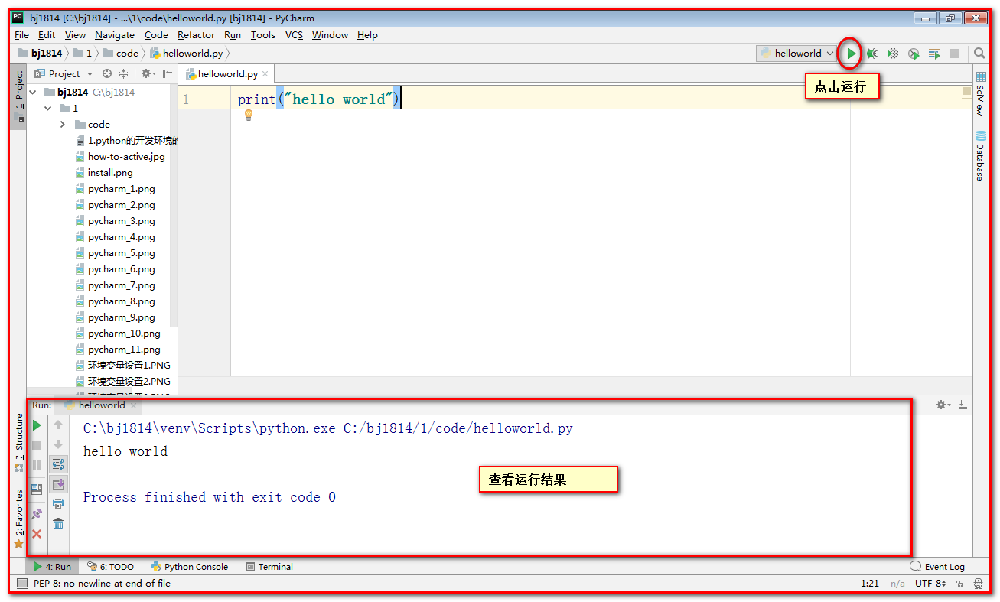