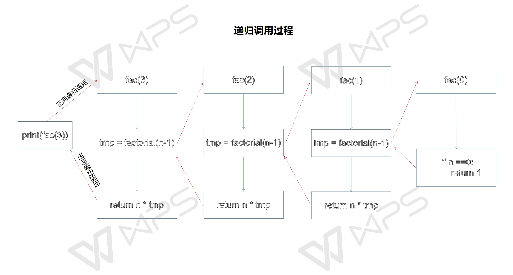

# 函数（3）

## 1.偏函数

当一个函数有大量参数，调用的时候非常不方便，可以使用偏函数技术，将一些参数固定（给默认值），达到简化函数调用的目的。

```
import functools
def test(a,b,c,d):
    print(a, b, c, d)
#从前面固定参数，使用位置参数就行，1=>a，2=>b
test1 = functools.partial(test,1,2)
test1(3,4)  #3=>c  4=>d

#从后面固定参数，需要使用关键字参数
test2 = functools.partial(test,c=3,d=4)
test2(1,2)  #1=>a 2=>b

#如果固定的参数不连续，则需使用关键字参数固定
test3 = functools.partial(test,b=2,d=4)
test3(a=1,c=3) #需要使用关键字参数，否则会报错
```

## 2.变量的作用域

程序中的变量并不是在任意的位置都可以随意访问，在哪里可以访问取决于这个变量的作用域，变量的作用域指的是变量在那段代码中可以使用，可以使用变量的那段代码就是变量的作用域。在python中，只有函数/类/模块才引入作用域，if/elif/else , while/for,try/except等并不会引入新的作用域

```
#if语句不引入新作用域，msg在外面可以使用
if True:
    msg = "message"

print(msg)
```

### 2.1 变量作用域的分类

按照作用域划分，可以分为：

- L：Local，局部作用域  
- E：Enclosing，闭包作用域【闭包的外部函数中定义的变量】
- G：Global，全局作用域  在所有函数外定义的变量
- B：Built-in，內建作用域【内置作用域】

```
#1 局部作用域  
#局部变量只能在函数内部使用，外部无法引用
#局部变量的作用域从定义开始到函数体结束
def demo():
    num = 20  #局部变量  
    print(num)
demo()
#print(num) 错误

#闭包作用域
def outter():
   x = 10   #函数作用域,从定义开始到本函数结束
   def inner():
      y = x  #在闭包中可以引用
      print(y)
   return inner
pf = outter()
pf()  #执行闭包
print(pf.__closure__)

#全局作用域
x = 100    #全局作用域  从定义开始到本文件结束
def demo():
   print(x)
print(x)

#内建作用域，是指系统内建的函数或常量，在系统载入时加载，在所有模块中都可以直接引用
#比如说系统函数
print(max(1,2,3))  #max函数就是内建作用域  哪里都可以引用
def  demo():
    x = 30
    y = 50
    print(max(x, y))
```

### 2.2 变量作用域查找规则

以 L --> E --> G -->B 的规则查找，即：在局部找不到，便会去局部外的局部找（例如闭包），再找不到就会去全局找，最后到内建作用域中找。

### 2.3 全局变量和局部变量

定义在函数内部的变量拥有一个局部作用域，被称为局部变量

定义在函数外面的变量拥有一个全局作用域，被称为全局变量

局部变量和全局变量同名，局部优先

```
total = 0   #全局变量
def sum(arg1,arg2):
    total = arg1 + arg2   #局部变量
    print("函数内部：",total)
    return total
    
sum(10,20)
#print(total1)
print("函数外部：",total)

num = 1
def fun1():
    print(num) #UnboundLocalError: local variable 'num' referenced before assignment
    num = 123
    print(num)
fun1()
```

### 2.4 global和nonlocal

```
#1.在Python中，当内部作用域想修改全局变量的时候，则就要使用global关键字进行声明
num = 1
def fun1():
    global num   #告诉编译器，此处的num是全局变量
    print(num)   #1
    num = 123
    print(num)  #123
    
fun1()

a = 10
def test():
    global  a
    a = a + 1
    print(a)
test()

#2.如果要修改函数作用域中的变量，则使用nonlocal
#需要明确的是，nonlocal关键字定义在闭包里面
x = 0  #全局作用域

def outer():
    x = 1   #闭包作用域

    def inner():
        nonlocal x
        x = 2   #局部作用域
        print("inner:",x)  #2

    inner()
    print("outer：",x)  #1---->2

outer()
print("全局：",x)  #0

#nonlocal关键字：声明了该变量不只是在outer函数中有效,在inner函数内部也有效
```

## 3. 闭包

我们可以在一个函数中再定义一个函数，在函数内部定义的函数称之为***内部函数***，内部函数只能在函数内使用，不会污染外部空间。定义内部函数的函数称之为***外部函数***，这样的定义构成函数的嵌套

```
def outter(a): #外部函数
    x = 10
    def inner(y):  #内部函数
        print(x + y)
    inner(a)
    
outter(20)
```

- 内部函数只能在外部函数里调用，外界无法直接调用内部函数

在一个外部函数中定义了一个内部函数，内部函数里引用了外部函数的变量，并且外部函数的返回值是内函数的引用。这样内部函数和其执行所需的环境变量就构成了一个***闭包***。

一般情况下，如果一个函数结束，函数的内部所有东西都会释放掉，局部变量都会消失。但是闭包是一种特殊情况，如果外函数在结束的时候发现有自己的局部变量将来会在内部函数中用到，就把这个局部变量绑定给了内部函数，然后自己再结束。

```
def outter(a): #外部函数
    x = a
    def inner(y):  #内部函数
        return x + y  #引用外部变量
    return inner  #返回内部函数（闭包）
pf = outter(20)
print(pf(10))  #30
print(pf(20))  #40
```

在闭包中无法直接修改外部变量x的值

```
def outter(a): #外部函数
    x = a
    def inner(y):  #内部函数
       # x += 10   #UnboundLocalError: local variable 'x' referenced before assignment
        return x + y
    return inner
```

在python3中可以通过nonlocal关键字声明一下x，表示这个变量不是局部变量，需要向上一层变量空间找这个变量。

```
def outter(a): #外部函数
    x = a
    def inner(y):  #内部函数
        nonlocal x
        x += 10
        return x + y
    return inner
```

## 4 装饰器(重点，难点)

软件开发中有一条非常重要的规则就是：对修改封闭，对扩展开放。
对于一个现有的函数，如果想要增强此函数的功能，但是不允许修改此函数源代码的时候，使用装饰器来解决这个问题

- 本质：就是一个闭包，还是一个返回函数的高阶函数


- 好处：就是在不用修改原函数代码的前提下给函数增加新的功能

###4.1 装饰器写法

~~~
#被修饰的函数
def say_hello(name):
	print('我就是人见人爱，花见花开的%s'%name)
	
# 参数是被修饰函数
def wrapper(func):     #1.定义装饰器
    def inner(name):   #2.定义闭包 在闭包中增加功能
        print('-' * 50)
        func(name)     #3.调用原函数实现原来的功能
        print('*' * 50)
    return inner       #4.返回增强功能的函数

say_hello = wrapper(say_hello) #5.获取增强功能的函数
say_hello('风流小王子')         #6. 调用增强函数，实现功能
~~~

###4.2使用@语法糖将装饰器应用到指定函数上，简化使用

~~~
#用法：在需要被装饰的函数前面加上:  @装饰器的名字  【外层函数的名字】
def wrapper(func):
  def inner(age1):
      #增加的功能
      if age1 < 0:
          age1 = 0
      #调用原函数
      func(age1)
  return inner
  
@wrapper     #相当于 getAge = wrapper(getage)
def getAge(age):
	print(age)
getAge(18)  #调用增强的函数
注意：使用@的时候，如果装饰器和需要被装饰的函数在同一个.py文件中的时候，装饰器一定要出现在被装饰函数的前面【Python中的代码是从上往下依次执行的】
~~~

### 4.3 带有不定长参数的装饰器

同一个装饰器可以应用于多个函数

~~~
def wrapper(func):       
  def inner(*tup,**kw):  #变长参数
      func(*tup,**kw)  
      print('-'*50)    
  return inner    
  
@wrapper                 
def test1(a,b):    
	print(a,b)  
test1(1,2)       

@wrapper                 
def test1(a):        
      print(a)   
~~~

### 4.4 多个装饰器作用在一个函数上(不重要)

~~~
#多个装饰器同时作用于一个函数的时候，要注意一下装饰器执行顺序
	def wrapper1(func):
	  print("wrapper1~~~~外部函数")
	  def inner(a,b):
	      print('wrapper1-----内部函数')
	      func(a,b)
	  return inner
	
	def wrapper2(func):
	 	print("wrapper2~~~~外部函数")
	    def inner(a, b):
	        print("wrapper2~~~~内部函数")
	        func(a, b)
	    return inner
	    
	@wrapper1
	@wrapper2
	def text(num1,num2):
		print(num1 + num2)	
		
	text(10,20)
~~~

## 5.递归函数(不是重点)

###5.1 嵌套调用

在函数A中可以调用函数B，在函数B中可以调用函数C，这种调用方式称为函数的嵌套调用。

### 5.2 递归调用

一个函数直接或间接的调用自己则称为递归调用。

~~~
def fac(n):
      if n ==0:  #递归终止条件，如果n为0，则结束递归调用，返回
          return 1
      else:
          tmp = fac(n-1)  #调用自己计算n-1的阶乘
          return n * tmp #返回n * (n-1)!
    print(factorial(5))  #120
~~~

### 5.3 递归调用过程

递归调用可分解为两个过程，正向递归调用和逆向递归返回。



### 5.4 递归适用条件

如果一个问题规模缩减后，求解方式和原来一样，小规模问题解决后导致问题的最终解决，则可适用递归

- 形式是递归的  阶乘和斐波那契数列
- 结构是递归的  列表遍历
- 解法是递归的  汉诺塔

递归的写法：

- 一个递归程序必须包含两部分：
  - 1） 递归终止条件
  - 2） 递归调用自己

~~~
def  recurve(*args,**kw):	
      if 递归终止条件:   #递归终止条件必须在递归调用前
          # to do 
       else:
          #to do
          recurve(参数)
          #to do
~~~

